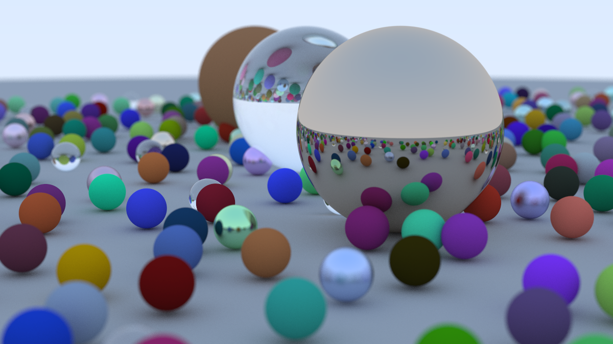

# BK Raytraces in 1 weekend

A repo of all the code I wrote while reading the [Ray Tracing in One Weekend Book Series](https://raytracing.github.io)

## Book 1: Ray Tracing in One Weekend

### Files

| Chapter | File | Description |
| --- | --- | --- |
| 2 | [main.cpp](src/main.cpp) | Creates world to render |
| 3 | [vec3.h](src/vec3.h) | Vector utility class copied from book |
| 3 | [color.h](src/color.h) | Color utility class |
| 4 | [rays.h](src/rays.h) | Ray utility class |
| 6 | [hittable.h](src/hittable.h) | abstract class for objects a ray can hit |
| 6 | [hittable_list.h](src/hittable_list.h) | class to contain a list of hittables that represent the world |
| 6 | [sphere.h](src/sphere.h) | class that extends hittable to represent a sphere |
| 6 | [rtweekend.h](src/rtweekend.h) | main header with utilities |
| 6 | [interval.h](src/interval.h) | class to represent real intervals |
| 7 | [camera.h](src/camera.h) | class to represent the camera |
| 10 | [material.h](src/material.h) | class to represent materials |

### Images

| Chapter | File | Description |
| --- | --- | --- |
| 2 | [helloworld.ppm](images/helloworld.ppm) | Creates a gradient square |
| 4 | [rays.ppm](images/rays.ppm) | Uses y coordinate of ray to generate a gradient |
| 5 | [spheres.ppm](images/spheres.ppm) | creates a sphere on top of rays.ppm |
| 6 | [normals.ppm](images/normals.ppm) | renders the normals of a sphere |
| 6 | [multiple_objects.ppm](images/multiple_objects.ppm) | renders two spheres |
| 7 | [multiple_objects_refactor.ppm](images/multiple_objects_refactor.ppm) | multiple_objects but refactored to use camera.h |
| 8 | [antialiasing.ppm](images/antialiasing.ppm) | multiple_objects but with antialiasing |
| 9 | [diffuse1.ppm](images/diffuse1.ppm) | first diffuse material render |
| 9 | [diffuse2.ppm](images/diffuse2.ppm) | diffuse material render with max depth |
| 9 | [diffuse3.ppm](images/diffuse3.ppm) | diffuse material render with shadow acne removed |
| 9 | [diffuse4.ppm](images/diffuse4.ppm) | diffuse material render with Lambertian reflection |
| 9 | [diffuse5.ppm](images/diffuse5.ppm) | diffuse material render with gamma correction |
| 10 | [metal1.ppm](images/metal1.ppm) | metal and lambertian materials render |
| 10 | [metal2.ppm](images/metal2.ppm) | added fuzziness to the metal |
| 11 | [always_refract.ppm](images/always_refract.ppm) | added dielectric that only refracts light |
| 11 | [total_internal_reflection.ppm](images/total_internal_reflection.ppm) | an air bubble that shows total internal reflection |
| 11 | [hollow_sphere.ppm](images/hollow_sphere.ppm) | a glass sphere with a bubble, uses reflectance to do both reflection and refraction |
| 12 | [fov_test1.ppm](images/fov_test1.ppm) | tests using vertical fov with 2 spheres |
| 12 | [fov_test2.ppm](images/fov_test2.ppm) | tests new camera position with fov of 90 deg |
| 12 | [fov_test3.ppm](images/fov_test3.ppm) | tests new camera position with fov of 20 deg |
| 13 | [defocus.ppm](images/defocus.ppm) | tests defocus blur |
| 14 | [final_scene.ppm](images/final_scene.ppm) | final render |
| X | [multithread.ppm](images/multithread.ppm) | experiment to see if multithreading changes produce same image but faster |

## Book 2: Ray Tracing in One Week

### Files

| Chapter | File | Description |
| --- | --- | --- |
| 3 | [aabb.cpp](src/aabb.cpp) | Class for Axis Aligned Bounded Boxes |
| 3 | [bvh.h](src/bvh.h) | A Bounding Volume Heirarchy class ( a tree for detecting ray hits faster) |
| 4 | [texture.h](src/texture.h) | A class for defining textures |

### Images

| Chapter | File | Description |
| --- | --- | --- |
| 2 | [motion_blur.ppm](images/motion_blur.ppm) | Adds motion blur to the diffuse spheres of the book 1 render |
| 3 | [bvh.ppm](images/bvh.ppm) | Uses BVH to reduce render time by roughly 7x. Note I diverge from the book here and use my own bvh construction algorithm based on the surface area heuristic |
| 4 | [checkered_ground.ppm](images/checkered_ground.ppm) | Adds a checkered texture to ground. |
| 4 | [two_checkered_spheres.ppm](images/two_checkered_spheres.ppm) | TWO checkered spheres. Note the checkers are in x,y,z space not uv space |
| 4 | [earth.ppm](images/earth.ppm) | Renders a sphere with the earth texture on it |

### How to build

g++ src/main.cpp -o main.o -pthread -std=c++11 -O3